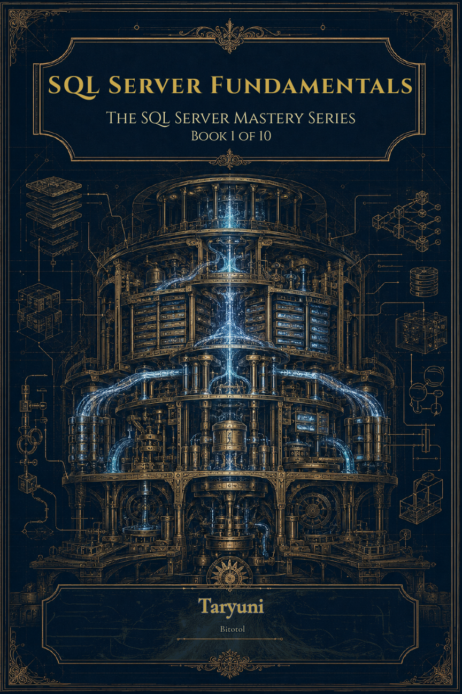

# SQL Server Mastery Series

**Author:** Taryuni  
**Publisher:** Bitotol  
**Target:** SQL Server 2022 (scripts compatible with SQL Server 2019+)

---

## About This Series

The SQL Server Mastery Series is a structured progression for IT professionals who want to build real competence as SQL Server DBAs. Each book builds on the last — taking you from your first installation through performance tuning, backup strategy, high availability, security, automation, cloud migration, and career development.

This is not a reference library. It is a deliberate sequence. Book 1 builds the foundation. Every book after it assumes you have that foundation.

This repository contains the companion code for the entire series: the shared TarLogistics practice database and the chapter scripts from each book.

---

## Books in This Series

| Cover | # | Title | What You'll Learn | Status |
|-------|---|-------|-------------------|--------|
|  | 1 | **SQL Server Fundamentals** | Installation, SSMS, databases and storage, services, logins and permissions, T-SQL for DBAs, monitoring, and routine maintenance | Available |
|  | 2 | **Performance Tuning** | Execution plans, index design, wait statistics, blocking and deadlocks, parameter sniffing, Query Store, memory configuration | Coming soon |
|  | 3 | **Backup and Recovery** | Recovery models, backup chains, RESTORE syntax, point-in-time recovery, RTO/RPO, backup automation, disaster recovery planning | Coming soon |
|  | 4 | **High Availability and Disaster Recovery** | Always On Availability Groups, failover clustering, log shipping, hybrid HA architecture | Planned |
|  | 5 | **Database Security** | Auditing, encryption, row-level security, server hardening, compliance fundamentals | Planned |
|  | 6 | **T-SQL for Database Professionals** | Window functions, CTEs, dynamic SQL, error handling, advanced query patterns for DBA work | Planned |
|  | 7 | **Monitoring and Alerting** | SQL Server Agent, extended events, custom alert frameworks, building a production monitoring routine | Planned |
|  | 8 | **Automation and Scripting** | PowerShell, dbatools, scheduled maintenance at scale, automating repetitive DBA tasks | Planned |
|  | 9 | **Azure SQL and Cloud Migration** | Moving on-premises workloads to Azure, managed instances, hybrid architecture, what changes in the cloud | Planned |
|  | 10 | **The DBA Career Playbook** | Interviews, salary negotiation, specialization paths, certifications, what senior actually looks like | Planned |

---

## The Practice Database: TarLogistics

TarLogistics is a realistic logistics company database built specifically for this series. It is not a toy schema — it is a 21-table operational database covering parties, shipments, tracking events, HR, finance, and more.

Every book in the series uses TarLogistics. You set it up once in Book 1 and keep working with it through every subsequent book. By the time you reach the later books, you will know the schema intuitively — which is the point. Real DBA work means knowing your databases, not learning a new one every chapter.

---

## Repository Structure

```
SQL-Server-Mastery-Series/
├── TarLogistics/                        ← Shared practice database (all books)
│   ├── README.md
│   ├── TarLogistics-DDL.sql
│   └── seed/
│       ├── 00-run-all.sql
│       ├── 01-parties.sql
│       ├── 02-network.sql
│       ├── 03-hr.sql
│       ├── 04-catalog.sql
│       ├── 05-operations.sql
│       └── 06-finance.sql
├── Book01-SQL-Server-Fundamentals/
│   ├── README.md
│   └── scripts/
│       ├── ch04-ssms-queries.sql
│       ├── ch05-databases-files.sql
│       ├── ch06-services.sql
│       ├── ch07-logins-users-permissions.sql
│       ├── ch08-tsql-for-dbas.sql
│       ├── ch09-monitoring.sql
│       └── ch10-routine-maintenance.sql
├── Book02-Performance-Tuning/
│   └── README.md
├── Book03-Backup-Recovery/
│   └── README.md
└── ...                                  ← Books 4–10 added as they release
```

---

## Getting Started

**Step 1 — Get the book.**  
The scripts in this repository are companion material. They are designed to be used while reading the corresponding book, not in isolation. Each script references the chapter it belongs to.

**Step 2 — Set up TarLogistics.**  
See `TarLogistics/README.md` for three setup options:
- DDL only (fastest — structure without data)
- DDL + seed data (recommended — full exercises require real data)
- Backup restore (if provided with your copy of the book)

**Step 3 — Open the scripts for your current book.**  
Each `scripts/` folder contains one file per chapter. Open them in SSMS while reading the corresponding chapter. Run them sequentially — they are not designed to be executed all at once.

---

## Requirements

- SQL Server 2022 Developer Edition (free) or any edition of SQL Server 2019+
- SQL Server Management Studio (SSMS) 19 or later
- SQLCMD (for seed data only — included with SQL Server tools)

> SQL Server Developer Edition is a fully featured version of SQL Server licensed for development and testing. It is free and the right choice for anyone working through this series.

---

## About the Author

Taryuni is a SQL Server DBA and technical educator based in Montréal, Canada. His work sits at the intersection of database administration, systems thinking, and practical education — with a focus on helping IT professionals build real, career-ready skills rather than theoretical knowledge they cannot apply.

The SQL Server Mastery Series draws on more than a decade of hands-on DBA experience across industries, including logistics, healthcare, and financial services.

---

## License

Scripts in this repository are provided for educational use under the MIT License. You may use, modify, and share them freely for personal learning and teaching purposes.
